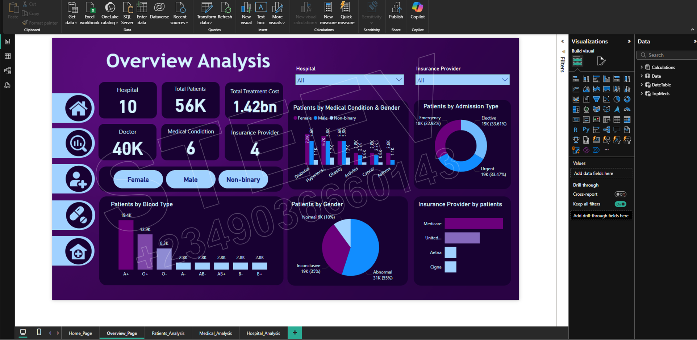
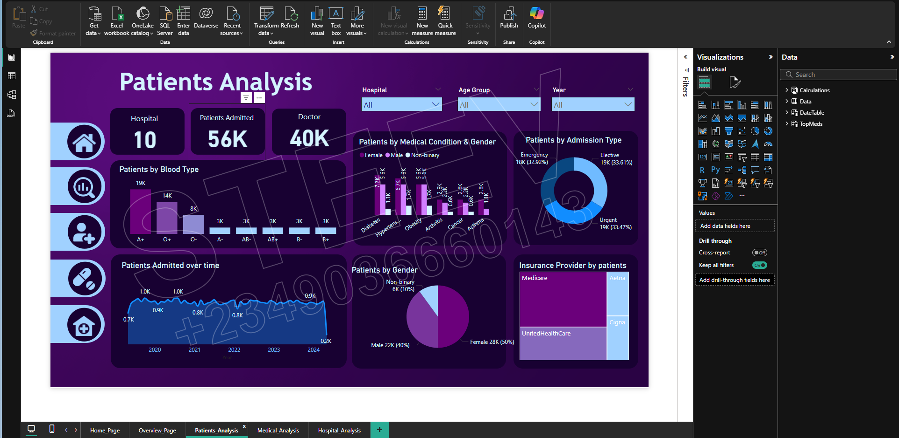
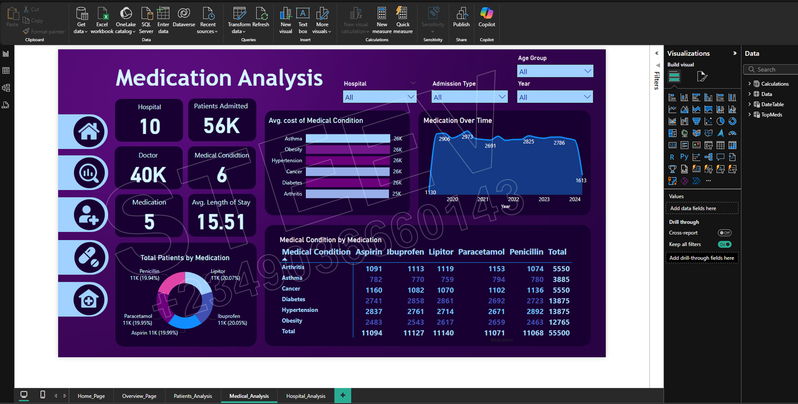
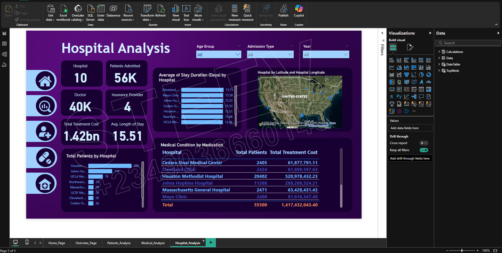

# HealthCare Analysis (2019 - 2024)

## 📘 Introduction

This Power BI dashboard provides an overview of healthcare data, including metrics related to hospitals, patients, medical conditions, admission types, blood types, gender demographics, and insurance providers. The goal is to support healthcare management with data-driven insights for effective decision-making.

## 📂 Project Structure

- **📦 HealthCare_Analysis.pbix**: The full Power BI report file.
- **📊 dashboards/**: Contains screenshots of the dashboard pages.
- **📊 images/**: Contains screenshots of the tables and their relation.
- **📄 Key Insight & Recommendations.md**: A detailed markdown Recommendations to the analysis and findings.
- **README.md**: Overview of the project.

## 🧠 Problem Solved

The analysis focuses on:

1. **Patient Demographics**
   - Gender distribution (Female, Male, Non-binary)
   - Blood type prevalence
   - Patient condition status (Normal, Abnormal, Inconclusive)

2. **Medical Conditions**
   - Breakdown of common conditions (e.g., Diabetes, Hypertension, Obesity, Arthritis, Cancer, Asthma)
   - Distribution across different gender categories

3. **Admission Types**
   - Categorization into Emergency, Elective, and Urgent admissions
   - Helps assess patient flow and hospital readiness

4. **Insurance Coverage**
   - Patient counts per insurance provider (e.g., Medicare, Aetna, United, Cigna)
   - Insights into health coverage utilization

5. **Healthcare Resource Metrics**
   - Total number of hospitals and doctors
   - Count of medical conditions treated
   - Total treatment cost incurred

6. **Time-Based Patient Trends**
   - Yearly admission trends (2020–2024)
   - Useful for evaluating growth or decline in patient admissions over time

## 🧠 Purpose of the Analysis

- Identify high-risk health conditions and their demographic patterns
- Support healthcare resource allocation (doctors, blood types, insurance)
- Enable data-driven decision-making for improved patient care
- Highlight gaps or anomalies, such as sudden drops in admission rates

## 🌐 Data Source

- The Data can be access access here: [Download_Here] 

## 🛠️ Tools Used
- Power BI
- DAX for custom measures
- Data modeling & transformation

## 🛠️ Skills & Concepts Demonstrated
PowerBI concepts like:
- Data Visualization (Bar Charts, Columns Charts, KPIs, Map, Table view)
- Report Design in Power BI
- Developing general DAX calculations that deal with text and numbers
- Data Modelling
- Data Cleaning
- Measures
- Filters
- Tooltips
- Navigation Buttons
- Creating columns
- Slicers
- Drilldown
- Creating Relationships

## 📈 Key Insights

1. **Gender Distribution**
   - Female - 50%, Male - 40%, Non-binary - 10%
   - Female patients make up the majority across most medical conditions.
   - Non-binary representation is included, showing inclusivity in data collection.

2. **Medical Conditions**  
   - Diabetes, Hypertension, and Obesity are the most common conditions among patients.
  
3. **Patient Admission Types**  
   - Emergency admissions constitute a significant portion, indicating a need for enhanced urgent care preparedness.
   - Elective and Urgent admissions are nearly equal, suggesting balanced scheduling and demand.

4. **Insurance Provider Coverage**  
   - Medicare holds the highest number of insured patients.
   - Other providers like United and Cigna also contribute significantly, implying a diverse insurance landscape.

5. **Blood Type Distribution**  
   - A+ is the most common blood type among patients, followed by O+ and O-.
   - Rarer blood types (e.g., AB-) are present in smaller numbers, which may impact emergency preparedness for transfusions.

6. **Patient Condition Status**  
   - A high percentage of patients (55%) are marked as having abnormal conditions.
   - A notable portion (35%) is labeled as inconclusive, suggesting room for improved diagnostics or data quality.

7. **Healthcare Resource Utilization**  
   - A total of 10 hospitals and 40K doctors are handling 56K patients.
   - Total treatment costs reach approximately **1.42 billion**, indicating significant healthcare expenditure.

8. **Admission Trends Over Time**  
   - Patient admissions have varied across the years 2020–2024, showing fluctuating demand that may be tied to external factors like pandemics or policy changes.
  
## ✅ Recommendations

1. **Investigate 2024 Admission Drop**
   - The sharp decline in patient admissions in 2024 should be reviewed.
   - Verify data completeness and check for potential causes such as hospital closures, system issues, or policy changes.

2. **Enhance Preventive Healthcare Programs**
   - Given the high prevalence of Diabetes and Hypertension, focus on preventive campaigns.
   - Encourage regular screenings, healthy lifestyle education, and early interventions.

3. **Improve Diagnostic Accuracy**
   - With 35% of patient conditions marked as "Inconclusive", there is a need to enhance diagnostic tools and medical assessments.

4. **Strengthen Emergency Response Capacity**
   - A large proportion of emergency admissions indicates a need for better-equipped emergency departments and faster response systems.

5. **Optimize Insurance Strategy**
   - While Medicare covers most patients, assess whether private insurance options are accessible and effectively used.
   - Explore partnerships with underutilized insurers to balance load and cost.

6. **Plan for Blood Inventory Management**
   - Focus blood donation drives around the most common blood types (A+, O+).
   - Maintain minimum stock levels for rare blood types (AB-, B-).

7. **Support Gender-Inclusive Care**
   - Ensure that all facilities are trained and equipped to provide care that is sensitive and inclusive of all gender identities.

8. **Monitor Yearly Trends for Resource Allocation**
   - Use yearly admission trends to guide staffing, budget allocations, and infrastructure development in hospitals.

## 📊 Dashboard Previews

| Overview Analysis | Patients Analysis | Medication Analysis |  Hospital Analysis
|----------------|------------------|------------------| ------------------|
|  |  |  |  |

---

💼 Developed by [Stephen Adeniyi](https://github.com/SteevAnalytics/) || 📅 2025

